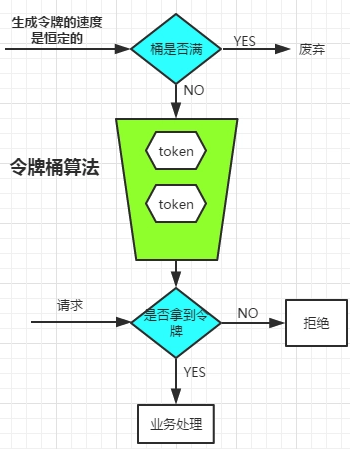

# Limiter
限流算法实现
## 面试场景

不知道你是否在面试的时候被问过这个问题：

面试官：“**假如一个人，在一秒内刷了你这个接口100万次，你要怎么做才能阻止他这么做？**”

我：“不可能，根本不可能，我试过，不可能1秒内点击100万次（狗头）”。

对话结束，面试结束....

## 前言

这个问题其实是很常见的一个问题「限流」。其实它不单单能阻止我们的接口被不怀好意的人狂刷，很多场景都需要去应用它，比如在抢火车票的时候就会出现“你的操作频率过快”，这就是12306使用对你的ip进行了限流。

常见的限流算法有如下几种：

* 固定时间段内的计数法
* 滑动窗口内的计数法
* 漏桶算法
* 令牌桶算法

掌握了这几种，面试的时候直接 bababa 和面试官说，吓死他。

本文将从实战的角度，利用AOP（最近研究它好像比较多）配合注解的方式来实现这几种限流算法。

AOP配合注解是一种非常常见且好用的功能增强方式，如果你还不会，可以去看看我之前写的一篇文章：https://juejin.cn/post/7244492473933365304
如果懒得看也没关系，只要你会AOP，其实也能看懂。

## 固定窗口限流

### 原理

固定窗口的限流方法，比较简单粗暴：将时间分为一段一段的，在每段时间内指定可以访问的最大次数，时间段内超过这个次数的请求就会被拦截。


#### 优点

* 实现简单

#### 缺点

* 存在临界突刺问题

  

### 实现

```java
/**
* 通用限流器
*/
@Retention(RetentionPolicy.RUNTIME)
@Target(ElementType.METHOD)
@Documented
public @interface Limiter {

    // 接口路径
    @NotNull
    String res() default "";

    // 最大访问次数
    @NotNull
    int permits();

    // 提示信息
    String msg() default "请不要频繁点击";
}
```

```lua
-- key：限流的键名，例如 "rate_limit:api_request"
-- max_requests：窗口时间内允许的最大请求次数
-- window_size：时间窗口的长度
-- 返回值：如果未超过限流，返回 当前请求数；如果超过限流，返回 0
local key = KEYS[1]
local max_requests = tonumber(ARGV[1])
local window_size = tonumber(ARGV[2])

local current_count = redis.call('GET', key)
if not current_count then
    redis.call('ADD', key, 1)
    redis.call('EXPIRE',key,window_size)
    return 1
end

if current_count and current_count < max_requests then
    redis.call('INCRBY',key,1)
    return current_count + 1;
else
    return 0
end

```

```java
/**
 * 固定窗口限流
 */

@Retention(RetentionPolicy.RUNTIME)
@Target(ElementType.METHOD)
@Documented
public @interface FixedWindow {
    @NotNull
    Limiter limiter();

    // 固定窗口的时间长度
    long len();

    // 时间单位
    TimeUnit unit() default TimeUnit.SECONDS;

}
```

```java
/**
* 为了控制并发，需要用lua脚本保证原子性
*/
@Aspect
@Component
@Slf4j
public class FixedWindowAspect {

    private StringRedisTemplate stringRedisTemplate;
    @Resource(name = "fixedWindowLimiter")
    private RedisScript<Long> fixedWindowLimiter;

    @Autowired
    public FixedWindowAspect(StringRedisTemplate stringRedisTemplate) {
        this.stringRedisTemplate = stringRedisTemplate;
    }

    @Before("@annotation(com.hss.ratelimiter.anno.FixedWindow)")
    public void before(JoinPoint joinPoint) throws Throwable {
        MethodSignature signature = (MethodSignature) joinPoint.getSignature();
        Method method = signature.getMethod();

        FixedWindow fixedWindow = method.getAnnotation(FixedWindow.class);
        Limiter limiter = fixedWindow.limiter();
        // 接口
        String res = limiter.res();
        // 需要限流的单位（用户/ip）
        String redisKey = LimiterUtils.getRedisKey(res);
        Long execute = stringRedisTemplate.execute(fixedWindowLimiter, Collections.singletonList(redisKey), String.valueOf(limiter.permits()), String.valueOf(fixedWindow.len()));
        // 如果存在这个key
        if (execute == 0) {
            log.debug(limiter.msg());
            throw new LimiterException(limiter.msg(), "123001");
        }else if (execute == 1) {
            log.info("创建固定窗口限流，key:{},当前请求次数:{},最高请求次数:{}",redisKey,1,limiter.permits());
            
        }else {
            log.info("当前请求次数:{},最高请求次数:{}",execute,limiter.permits());
        }
        
    }
}
```

```java
/**
* 测试
* 注意：配置了10秒内可以重复访问10次，再多就会被拦截。
*/
@RestController
@RequestMapping("/test")
public class TestController {

    @GetMapping("/do")
    @FixedWindow(limiter = @Limiter(res = "/do",permits = 10), len = 10)
    public String doSomething() {
        return "do someting...";
    }
}
```

结果：


## 滑动窗口限流

### 原理

就不画图的，其实滑动窗口的思想就是以当前时间戳为**终点**，向前找窗口长度，得到窗口的**起点**，然后去计算起点到终点的请求次数是否符合我们给他设定的最大值。

这里我们可以使用 Redis 的 Zset 数据结构，这种数据结构带有一个score值，而且可以很方便的进行范围计数，我们可以使用 接口名 + 用户ip作为key， 使用访问时的时间戳作为score和value（事实上value可以随便，我们只是计算窗口内的请求个数而已）。

### 实现

由于使用了Zset，这里也需要使用lua脚本来防止并发场景下的不一致问题。

```lua
-- key：限流的键名，例如 "rate_limit:api_request"
-- max_requests：窗口时间内允许的最大请求次数
-- window_size：时间窗口大小（单位：秒）
-- current_time：当前时间戳（由 Redis 传递进来）
-- 返回值：如果未超过限流，返回 1；如果超过限流，返回 0
local key = KEYS[1]
local max_requests = tonumber(ARGV[1])
local window_size = tonumber(ARGV[2])
local current_time = tonumber(ARGV[3])

-- 移除过期的数据
redis.call('ZREMRANGEBYSCORE', key, '-inf', current_time - window_size)

-- 获取当前窗口的请求数量
local current_count = redis.call('ZCARD', key)

if not current_count or current_count < max_requests  then
    -- 如果请求数量未超过限制，将当前请求添加到 ZSET 中，并设置其分数为当前时间戳
    redis.call('ZADD', key, current_time, current_time)
    return current_count + 1
else
    -- 如果请求数量超过限制，返回 0 表示限流
    return 0
end
```

```java
/**
 * 自定义注解
 * 滑动窗口限流
 */

@Retention(RetentionPolicy.RUNTIME)
@Target(ElementType.METHOD)
@Documented
public @interface SlidingWindow {
    @NotNull
    Limiter limiter();

    // 窗口的时间长度
    long len();

    // 时间单位
    TimeUnit unit() default TimeUnit.SECONDS;
}
```

```java
/**
* 切面
*/
@Aspect
@Component
@Slf4j
public class SlidingWindowAspect {

    private StringRedisTemplate stringRedisTemplate;

    @Autowired
    private RedisScript<Long> slidingLimiter;

    @Autowired
    public SlidingWindowAspect(StringRedisTemplate stringRedisTemplate) {
        this.stringRedisTemplate = stringRedisTemplate;
    }

    @Before("@annotation(com.hss.ratelimiter.anno.SlidingWindow)")
    public void before(JoinPoint joinPoint) throws Throwable {
        MethodSignature signature = (MethodSignature) joinPoint.getSignature();
        Method method = signature.getMethod();

        SlidingWindow slidingWindow = method.getAnnotation(SlidingWindow.class);
        Limiter limiter = slidingWindow.limiter();

        // 接口
        String res = limiter.res();
        // 需要限流的单位（用户/ip）
        String redisKey = LimiterUtils.getRedisKey(res);
        int permits = limiter.permits();
        long len = slidingWindow.len();
        TimeUnit unit = slidingWindow.unit();
        long now = System.currentTimeMillis();
        if (unit == TimeUnit.SECONDS) {
            now = now / 1000;
        }
        Long isSuccess = (Long) stringRedisTemplate.execute(slidingLimiter, Collections.singletonList(redisKey), String.valueOf(permits), String.valueOf(len), String.valueOf(now));
        if (isSuccess == 1) {
            log.info("创建固定窗口限流，key:{},当前请求次数:{},最高请求次数:{}", redisKey, 1, limiter.permits());

        } else if (isSuccess > 1) {
            log.info("当前请求次数:{},最高请求次数:{}",isSuccess,limiter.permits());
        } else {
            throw new LimiterException(limiter.msg(), "123001");
        }
    }
}
```

```java
/**
*测试
*/
@RestController
@RequestMapping("/test")
public class TestController {

    @GetMapping("/do")
    @SlidingWindow(limiter = @Limiter(res = "/do",permits = 10), len = 10000, unit = TimeUnit.MILLISECONDS)
    public String doSomething() {
        return "do someting...";
    }
}
```

结果：


## 漏桶限流算法


### 原理

顾名思义，漏桶算法有一个 **桶**，请求会先放入这个桶中，经过桶后以**均匀的**速率出去，使得流量一直是我们系统能够接受的强度。

但是当桶装满了，多来的那些请求就会直接被拒绝，所以它有一个不好的地方：处理瞬时的大量请求时会导致部分请求被拒绝。

## 令牌桶限流



### 原理

令牌桶是对漏桶算法的改进，它不再是以恒定的速率去消费请求了，而是有一个线程去以一个恒定的速率向桶里面放 **令牌**，而请求到来的时候需要去桶里面获得令牌才能进行业务处理。

这种方法可以解决漏桶方法的不足，因为当瞬时流量到达的时候，我们的令牌桶中已经储存了一些令牌，这样就能使得更多的请求被处理。

### 实现

google 的一个工具包 guava 实现了令牌桶限流算法，我们这边就用它的就好了。

```xml
        <dependency>
            <groupId>com.google.guava</groupId>
            <artifactId>guava</artifactId>
            <version>30.1-jre</version>
        </dependency>
```

需要注意的是guava实现的**单机版**的限流，如果需要分布式限流，推荐使用redis的滑动窗口方法或者用redis实现类似guava的令牌桶算法。

```java
@Aspect
@Component
@Slf4j
public class TokenBucketAspect {


    private final Map<String, RateLimiter> limitMap = Maps.newConcurrentMap();

    @Before("@annotation(com.hss.ratelimiter.anno.TokenBucket)")
    public void before(JoinPoint joinPoint) throws Throwable {
        MethodSignature signature = (MethodSignature) joinPoint.getSignature();
        Method method = signature.getMethod();

        TokenBucket tokenBucket = method.getAnnotation(TokenBucket.class);
        Limiter limiter = tokenBucket.limiter();

        // 接口
        String res = limiter.res();
        // 需要限流的单位（用户/ip）
        String key = LimiterUtils.getRedisKey(res);
        long len = tokenBucket.len();  // 时间
        TimeUnit unit = tokenBucket.unit(); // 单位
        // 转换为s
        if (tokenBucket.unit() == TimeUnit.MILLISECONDS) {
            len /= 1000;
        }
        double permitPreSecond = (double) limiter.permits() / len;
        RateLimiter rateLimiter;

        if (!limitMap.containsKey(key)) {
            rateLimiter = RateLimiter.create(permitPreSecond);
            limitMap.put(key,rateLimiter);
            log.info("创建令牌桶限流，key:{},令盘产生速率：每秒{}个",key,permitPreSecond);
        }
        rateLimiter = limitMap.get(key);

        boolean acquire = rateLimiter.tryAcquire(1, 100, TimeUnit.MILLISECONDS);
        if (!acquire) {
            log.debug(limiter.msg());
            throw new LimiterException(limiter.msg(), "123001");
        }else {
            log.info("放行....");
        }
    }
}

```

```java
@Retention(RetentionPolicy.RUNTIME)
@Target(ElementType.METHOD)
@Documented
public @interface TokenBucket {

    @NotNull
    Limiter limiter();

    // 最大访问次数的时间长度
    long len();

    // 时间单位
    TimeUnit unit() default TimeUnit.SECONDS;
}

```

```java
@RestController
@RequestMapping("/test")
public class TestController {

    @GetMapping("/do")
    @TokenBucket(limiter = @Limiter(res = "/do",permits = 10), len = 10000, unit = TimeUnit.MILLISECONDS)
    public String doSomething() {
        return "do someting...";
    }
}
```

结果：（当桶中有足够的令牌，快速点击没事，当令牌耗尽且还没来得及生成新的，就会拦截）


## 总结

常见的几个限流算法都介绍并实现了一遍

总的来说，单机就用guava提供的令牌桶算法，如果是分布式系统，需要使用redis来实现限流算法，可以采用滑动窗口的方式，或者自己研究研究实现令牌桶。


